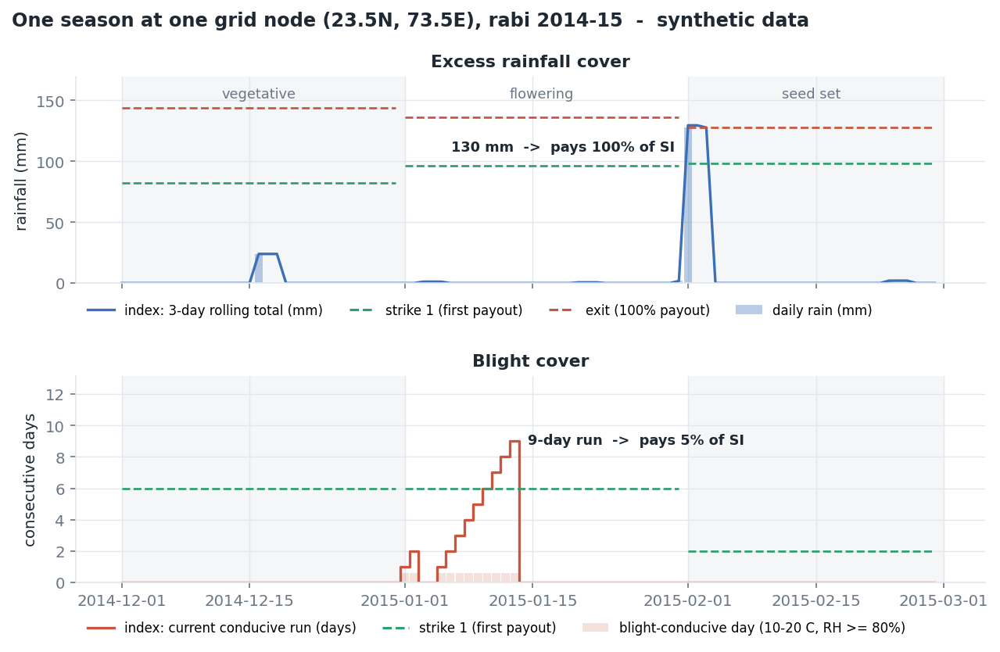
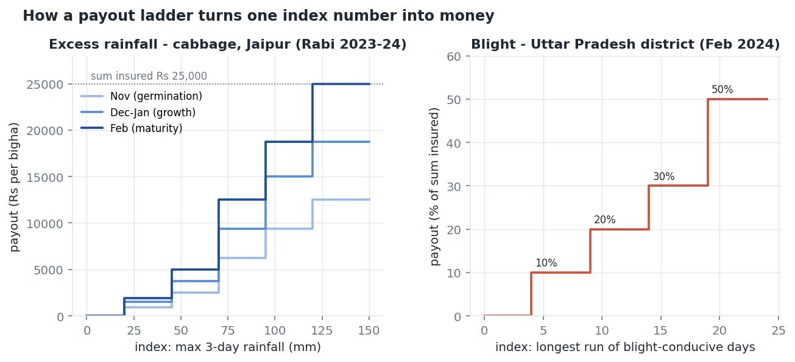
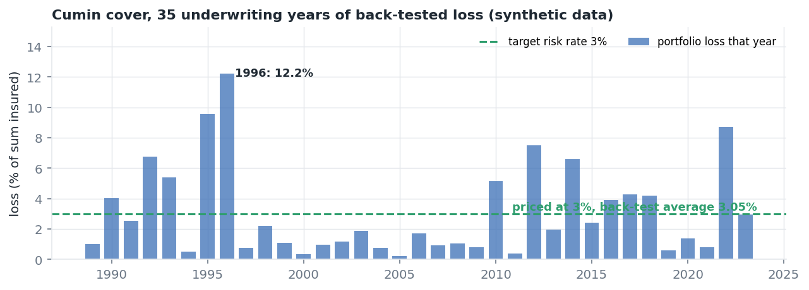

# Parametric Weather Risk Toolkit

An end-to-end, runnable version of the workflow I used to build and price
parametric (index-based) crop insurance: enrolment data in, priced term sheet
and loss summary out.

I spent 2023-24 as a risk analyst at **Weather Risk Management Services (WRMS)**
doing this work for live programmes across India, Central America, East Africa
and the Pacific. None of that data is in this repository and none of it can be —
it belongs to the clients and to the insurers who carried the risk. What is here
is the method, rebuilt from scratch on synthetic weather that is generated by
this repo, with a fixed seed, so anyone can clone it and reproduce every number
below.

```bash
git clone <this-repo> && cd parametric-risk-toolkit
pip install -r requirements.txt
python3 tests/test_toolkit.py     # 19 tests
bash scripts/run_all.sh           # full pipeline + figures, ~90 seconds
```



*What the cover looks like while the season is running: the index is recomputed
every day and compared with the strike for the phase the crop is in. Here a
130 mm three-day burst in early February clears the seed-set exit and pays in
full; a nine-day humid spell in January clears the first blight strike.*

---

## A real product, simplified

This is the shape of a cover I built and priced at WRMS — excess rainfall
on cabbage, Chomu sub-district, Jaipur, rabi 2023-24. Product terms only; the
client's exposure and loss data stay with the client.

| | |
|---|---|
| Peril | Excess rainfall (flooding, soil saturation) |
| Index | Maximum 3-day cumulative rainfall in the phase |
| Data | IMD gridded daily rainfall, pricing and settlement |
| Cover period | 1 Nov 2023 – 29 Feb 2024, three phases |
| Sum insured | Rs 25,000 per bigha |
| Premium | 4.5% of SI (Rs 1,125/bigha) or a cheaper 2.5% option with higher strikes |

| 3-day rainfall | Nov (germination) | Dec–Jan (growth) | Feb (maturity) |
|---|---:|---:|---:|
| ≥ 20 mm  | Rs 950    | Rs 1,500  | Rs 1,875  |
| ≥ 45 mm  | Rs 2,500  | Rs 3,750  | Rs 5,000  |
| ≥ 70 mm  | Rs 6,250  | Rs 9,375  | Rs 12,500 |
| ≥ 95 mm  | Rs 9,375  | Rs 15,000 | Rs 18,750 |
| ≥ 120 mm | Rs 12,500 | Rs 18,750 | Rs 25,000 |

The same rainfall pays more in February than in November because the crop is
worth more the closer it is to harvest — the ladder follows the value at risk,
not the weather. It went out with two premium options: same payouts, with the
2.5% version starting at 40 mm instead of 20 mm.



The blight cover on the right (a Uttar Pradesh district, February 2024) uses
the same machinery with a different index: the longest run of consecutive
blight-conducive days from ERA5, paying 10 / 20 / 30 / 50% of sum insured at
4 / 9 / 14 / 19 days.

---

## What the pipeline does

```
enrolment file                 daily gridded weather            storm tracks
      |                                |                              |
      v                                v                              v
 [1] snap to grid              [2] pick the dataset            [5] cyclone cover
     nearest node,                 event capture (POD/FAR/CSI),    max wind within
     snap distance audit           station bias, stationarity      a radius
      |                                |
      +----------------+---------------+
                       v
              [3] build phase indices
                  ERI / WDI / dry spell / blight spell / heat
                  one number per grid node per underwriting year
                       |
                       v
              [4] price to a target rate
                  strike ladder solved backwards from an
                  affordable ~3% risk rate, then burn cost,
                  risk premium, commercial premium, PML
```

Each step is a script in `scripts/`, each is independently runnable, and each
prints the table it produces.

---

## Reproducible output

Numbers below come from a clean run of `scripts/run_all.sh` (seed 20240115).

**Step 1 — enrolment to grid.** 1,200 policy locations snapped to 36 grid nodes:

```
    state district  locations  mean_snap_km  p95_snap_km  max_snap_km  far_locations  far_pct
RAJASTHAN    Ajmer        300         20.02        30.33        34.76             20     6.67
RAJASTHAN    Alwar        266         20.72        32.06        37.61             26     9.77
RAJASTHAN Bhilwara        315         20.54        31.21        37.17             30     9.52
RAJASTHAN     Kota        319         21.14        32.49        36.84             39    12.23
```

Locations beyond the snap tolerance are flagged, never dropped. A 35 km snap on
a convective-rainfall peril is a basis-risk decision an underwriter has to see
and sign off, not a rounding detail to hide.

**Step 2 — dataset selection.** Two candidate rainfall products, same index,
same trigger, scored against a documented event list:

```
        dataset  events_checked  hits  misses  false_alarms   POD   FAR   CSI
PRIMARY_GRIDDED            1224   517       3            49 0.994 0.087 0.909
    ALT_GRIDDED            1224   467      53             2 0.898 0.004 0.895
```

The alternate product almost never fires falsely — and misses 53 real events.
That is the trade the choice is actually about: misses are unpaid genuine
losses (you lose the distribution partner), false alarms are paid non-losses
(you lose the reinsurer). CSI ranks them; the operational question — is the
data published on time, is it versioned, can it be revised after settlement —
decides ties.

**Step 4 — priced product** (`Rabi Cumin – Blight & Excess Rainfall`, 3% target):

```
PRICING (exposure-weighted book)
  blended burn cost   : 3.029%
  risk premium        : 3.515%
  commercial premium  : 5.408%
  mean loss frequency : 15.4% of years

PORTFOLIO RISK METRICS
  expected_loss      0.0305        VaR_95        0.0898
  std_dev            0.0301        TVaR_95       0.1091
  max_loss           0.1223        PML_1_in_25   0.0927
```



Priced at 3% on average, but the book loses more than 9% in two years out of
35. That spread, not the average, is what the reinsurer is pricing.

---

## Four things in here that are not obvious

**Strikes are solved backwards from the price.** The client tells you what they
can afford — for a subsidised agri cover that is around 3% of sum insured, above
which the farmer will not buy and the subsidy will not stretch. So
`calibrate_ladder_to_target` fixes the rate and bisects in percentile space for
the ladder that delivers it, instead of choosing strikes and discovering the
price afterwards.

**The target is imposed after phases combine, not before.** Three crop-calendar
phases each calibrated to 1.8% do not combine to 1.8% — take the worst phase and
you are near 5%. `calibrate_peril_to_target` runs an outer bisection on the
common per-phase rate until the *combined* peril lands on its target. Getting
this wrong is how a rate quietly triples between the model and the term sheet;
the first version of this repo did exactly that, and the fix is in the git
history.

**A drifting peril shows up as a gap between the target and the blend.** The
wheat cover is calibrated to 3% on the full record and comes out at 4.02%:

```
TREND CHECK (index stationarity, early vs recent record)
  Terminal heat (grain filling)      shift  +35.4%   non-stationary
  Excess rainfall at harvest         shift  +36.6%   non-stationary
burn 10y / 20y / 30y: 4.639% / 4.049% / 3.380%
blended burn cost   : 4.022%   (target 3.00%)
```

That is not a calibration failure, it is the answer. Heat days in the grain-
filling phase are up 35% between the early and recent halves of the record, so
the trailing-10-year window prices 1.3 points above the 30-year one and the
blend follows it. A cover priced off the full history alone would have been
sold a point too cheap. The cumin cover, whose heat exposure is nil, lands on
3.03%.

The rainfall flag on the same run is a good illustration of the test's limits:
a mean-shift test on a heavy-tailed index moves a long way on a handful of
extreme years, so `non-stationary` there is a prompt to go and look at the
series, not a verdict. The heat index, being a bounded day count, is where the
test is actually informative.

**The underwriting year is not the calendar year.** A rabi cover runs December
to February and spans two calendar years while being one season. If January is
left in its own calendar year, every season splits in two, event counts halve,
and the burn cost comes out roughly half of what it should be. `wrap_months`
handles it; a test pins it.

---

## Layout

```
src/
  gridding.py     haversine snap, exposure weights, snap-quality audit
  indices.py      ERI, WDI, dry spell, disease spell, heat, cyclone proximity
  pricing.py      strike ladders, phase/peril combination, burn cost,
                  risk & commercial premium, VaR/TVaR/PML, rate calibration
  validation.py   POD/FAR/CSI event capture, station bias, stationarity,
                  basis-risk report
  products.py     crop calendars and product specs, declarative
  simulate.py     synthetic weather, exposure and storm tracks
scripts/          01 generate -> 02 map -> 03 select -> 04 index -> 05 price -> 06 cyclone -> 07 figures
tests/            19 unit tests on the parts that fail silently
docs/             workflow, dataset selection, pricing notes, field notes
```

Only `pandas` and `numpy`. The nearest-neighbour search is a chunked haversine
in numpy rather than a geospatial stack, so the repo installs anywhere.

---

## Where this comes from

At WRMS I ran the index and pricing work for a multi-state Indian agri
programme end to end — enrolment intake on a fortnightly cycle, grid mapping,
index construction, product design, pricing and the post-season loss summaries —
and did index, product or dataset work for programmes in Honduras, Haiti,
Tanzania, the Philippines, Papua New Guinea, Fiji and Samoa.

Perils: excess rainfall, deficit rainfall / drought, dry spells, late blight and
other disease-conducive covers, terminal heat, unseasonal rainfall, fog, and
cyclone wind.

Datasets: IMD gridded rainfall and temperature, IMD AWS and surface stations,
ERA5 and ERA5-Land, CHIRPS, CMORPH, TAMSAT, GEFS/GFS forecast fields, national
met service station data, and IBTrACS cyclone tracks.

`docs/04-field-notes.md` has the detail, written as notes rather than a pitch.

---

Manoj Kumar Sen · Kota, Rajasthan · manoj11111116@gmail.com
